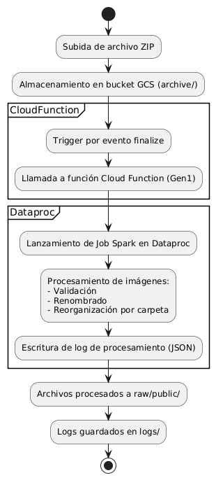

# **HUD AI Ingestion Pipeline**

Este repositorio implementa un sistema automatizado de ingestión y procesamiento de archivos `.zip` que contienen imágenes para entrenamiento de modelos de visión artificial. Está diseñado para ejecutarse sobre Google Cloud Platform (GCP), combinando almacenamiento en GCS, ejecución distribuida con Dataproc (Apache Spark) y automatización mediante Cloud Functions.

El flujo permite subir archivos comprimidos al bucket `gs://svr_object_storage/archive/`, y lanza automáticamente un job de Spark para validar, reorganizar y registrar las imágenes en la estructura definida.

## **Estructura del repositorio**

```plaintext
.
├── .github/workflows/
│   └── deploy-to-gcs.yml             # Workflow para sincronización automática con GCS
├── cloud_function/
│   ├── main.py                       # Cloud Function que lanza jobs en Dataproc
│   └── requirements.txt              # Dependencias necesarias para la función
├── config/
│   └── youtube_metadata.json         # Metadatos adicionales para datasets provenientes de vídeo
├── .gcloudignore                     # Archivos ignorados en despliegues GCP
├── .gitignore                        # Archivos ignorados por Git
├── LICENSE                           # Licencia Apache 2.0
├── README.md                         # Documentación técnica del proyecto
├── ZIP_ingestion_guidelines.md       # Guía para la estructuración correcta de archivos `.zip`
├── main.py                           # Script principal de procesamiento (Spark)
├── requirements.txt                  # Dependencias para ejecución local o en Dataproc
```

## **Arquitectura funcional del sistema**

El siguiente diagrama ilustra el flujo automatizado de ingestión y procesamiento de archivos `.zip` en la infraestructura del proyecto HUD AI. Este pipeline está diseñado para operar de forma desatendida sobre Google Cloud Platform, desde la subida inicial del archivo hasta el registro final del procesamiento. La arquitectura contempla detección de eventos, ejecución distribuida y trazabilidad completa, garantizando escalabilidad, eficiencia y control de calidad en cada etapa.



## **Bucket principal y estructura de carpetas**

Bucket: `gs://svr_object_storage`

```plaintext
gs://svr_object_storage/
├── archive/              # Entrada: ZIPs subidos manual o programáticamente
├── raw/                  # Salida: imágenes reorganizadas y validadas
├── logs/                 # Archivos JSON con trazabilidad por cada ZIP procesado
├── code/                 # Código sincronizado desde GitHub (main.py, requirements.txt)
```

## **Reglas para los archivos `.zip`**

Los archivos comprimidos deben contener rutas estructuradas según la siguiente convención:

```plaintext
[dataset]/[escenario]/[split]/[imagen]
```

Valores aceptados:

* `split`: `train`, `val`, `test` o `unknown`
* `escenario`: niebla, noche, curva, etc. (o `unknown`)
* Imágenes aceptadas: `.jpg`, `.jpeg`, `.png`

Documentación completa disponible en [`ZIP_ingestion_guidelines.md`](./docs/ZIP_ingestion_guidelines.md).

## **Cloud Function (Gen1)**

La función desplegada se activa con eventos tipo `google.storage.object.finalize` sobre el bucket `archive/`. Lanza un job en Dataproc pasando los argumentos necesarios:

* `--zip_path`
* `--bucket_name`
* `--silver_path`
* `--logs_path`

La función incorpora control de duplicados, verificando si existe un archivo `logs/log_<nombre>.json` antes de lanzar el job.

## **Script de procesamiento en Spark**

El archivo `main.py` está adaptado para ejecución en Dataproc y acepta argumentos mediante `argparse`. Funcionalidad principal:

* Acceso directo al ZIP desde GCS
* Descompresión en memoria
* Validación y renombrado de imágenes
* Organización en rutas tipo `raw/public/dataset/escenario/split/`
* Generación de log estructurado en `logs/`

## **Automatización con GitHub Actions**

El repositorio incluye un flujo de trabajo automático (`.github/workflows/deploy-to-gcs.yml`) que sincroniza los archivos `main.py` y `requirements.txt` a la carpeta `code/` del bucket de GCS al realizar `push` sobre `main`.

## **Estado actual del sistema**

* Repositorio estructurado por ramas (`main` y `dev`)
* Cloud Function Gen1 operativa y desplegada
* Clúster Dataproc activo en región `us-central1`
* Código sincronizado mediante GitHub Actions
* Validación funcional completa con control de duplicados

## **Licencia**

Este proyecto está licenciado bajo los términos de la licencia Apache 2.0. Consultar el archivo `LICENSE` para más información.
