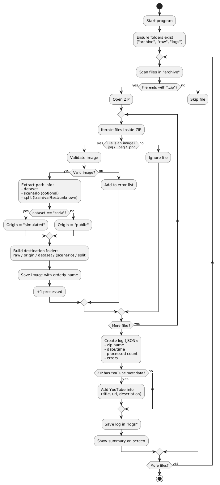
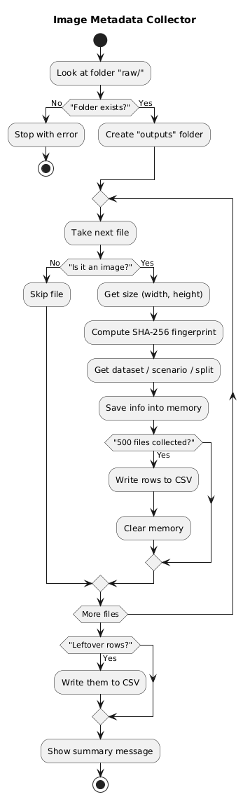

# **Entorno local de pruebas para procesamiento automático de archivos `.zip` y backfill de metadatos**

Este repositorio contiene una versión local del sistema de procesamiento automático de imágenes comprimidas en archivos `.zip`, pensada para **realizar pruebas, desarrollos y validaciones sin necesidad de desplegar en Google Cloud**.

> La rama `main` está destinada al entorno **de producción** y contiene el código adaptado para conectarlo al bucket `gs://svr_object_storage/`.

## **Funcionamiento del sistema**

El flujo local simula lo que realiza la función en la nube:

1. **Lee archivos `.zip` desde la carpeta `archive/`**
2. **Descomprime su contenido**
3. **Valida y renombra imágenes según estructura esperada**
4. **Reorganiza las imágenes en la carpeta `raw/`**
5. **Registra un log del procesamiento en `logs/`**
6. **(opcional)** Recorre la carpeta `raw/` y genera un CSV con metadatos en `outputs/`

## **Estructura del proyecto**

```plaintext
.
├── archive/             # Carpeta donde se colocan los archivos ZIP a procesar
├── raw/                 # Carpeta de salida con las imágenes organizadas
├── outputs/             # Carpeta donde se generan CSVs de metadatos
│   └── images_metadata.csv
├── logs/                # Logs generados automáticamente por cada ZIP procesado
├── docs/
│   ├── image_zip_workflow.png        # Diagrama del flujo de procesamiento de ZIP
│   ├── ZIP_ingestion_guidelines.md   # Normativa sobre la estructura de los `.zip`
│   └── backfill_workflow.puml        # PlantUML del flujo de backfill de metadatos
├── src/                 # Código Python modular
│   ├── __init__.py
│   ├── organizer.py     # Funciones para extraer y reorganizar imágenes
│   ├── metadata_csv.py  # Funciones para generar CSV de metadatos desde raw/
│   └── utils.py         # (opcional) utilidades comunes
├── main.py              # CLI principal: orquesta subcomandos
├── requirements.txt     # Dependencias necesarias para ejecución local
├── .gitignore
└── README.md
```

## **Ejecución local**

1. Crea y activa un entorno virtual:

   ```bash
   python -m venv venv
   source venv/bin/activate   # o venv\Scripts\activate en Windows
   ```

2. Instala las dependencias:

   ```bash
   pip install -r requirements.txt
   ```

3. Ejecuta el procesamiento de los `.zip`:

   ```bash
   python main.py extract
   ```

   Esto procesará todos los archivos `.zip` encontrados en la carpeta `archive/` y los reorganizará en `raw/`.

4. (Opcional) Generar el CSV de metadatos desde `raw/`:

   ```bash
   python main.py backfill
   ```

   Esto creará/actualizará `outputs/images_metadata.csv` con información como:

   * dataset / scenario / split
   * nombre de archivo y extensión
   * ancho y alto de la imagen
   * hash SHA256
   * fecha de ingesta (`ts_ingest`)

## **Diagramas**

### **Flujo de procesamiento de ZIP**

Toda la normativa relativa a la estructura de los `.zip` y las convenciones del sistema se encuentra descrita en: [`docs/ZIP_ingestion_guidelines.md`](docs/ZIP_ingestion_guidelines.md)



### **Flujo de backfill de metadatos**



## **Importante**

* Este entorno **no sube nada a Google Cloud**.
* Está pensado para validar datos, debuggear errores y verificar transformaciones antes de integrarlo en el pipeline real.
* La carpeta `archive/` actúa como origen inmutable; `raw/` y `outputs/` pueden regenerarse en cualquier momento.
